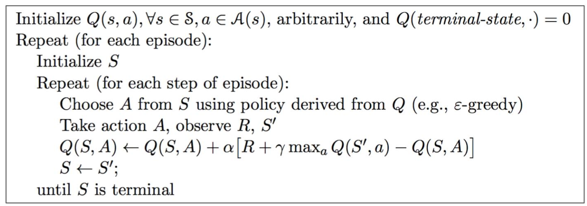
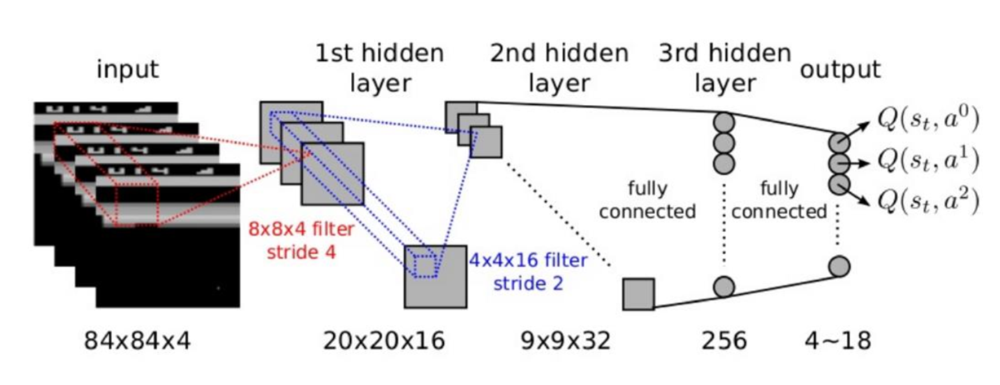
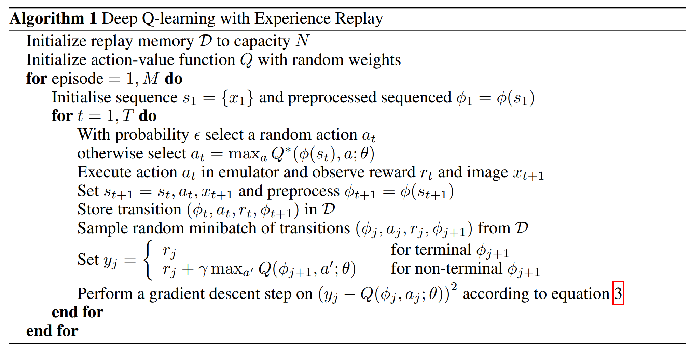
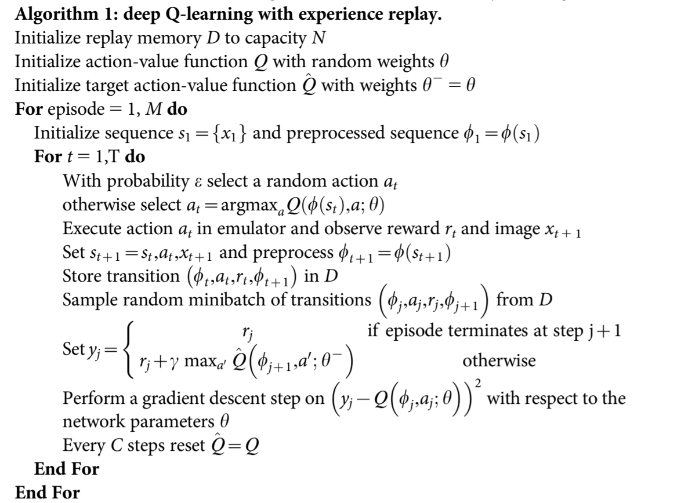
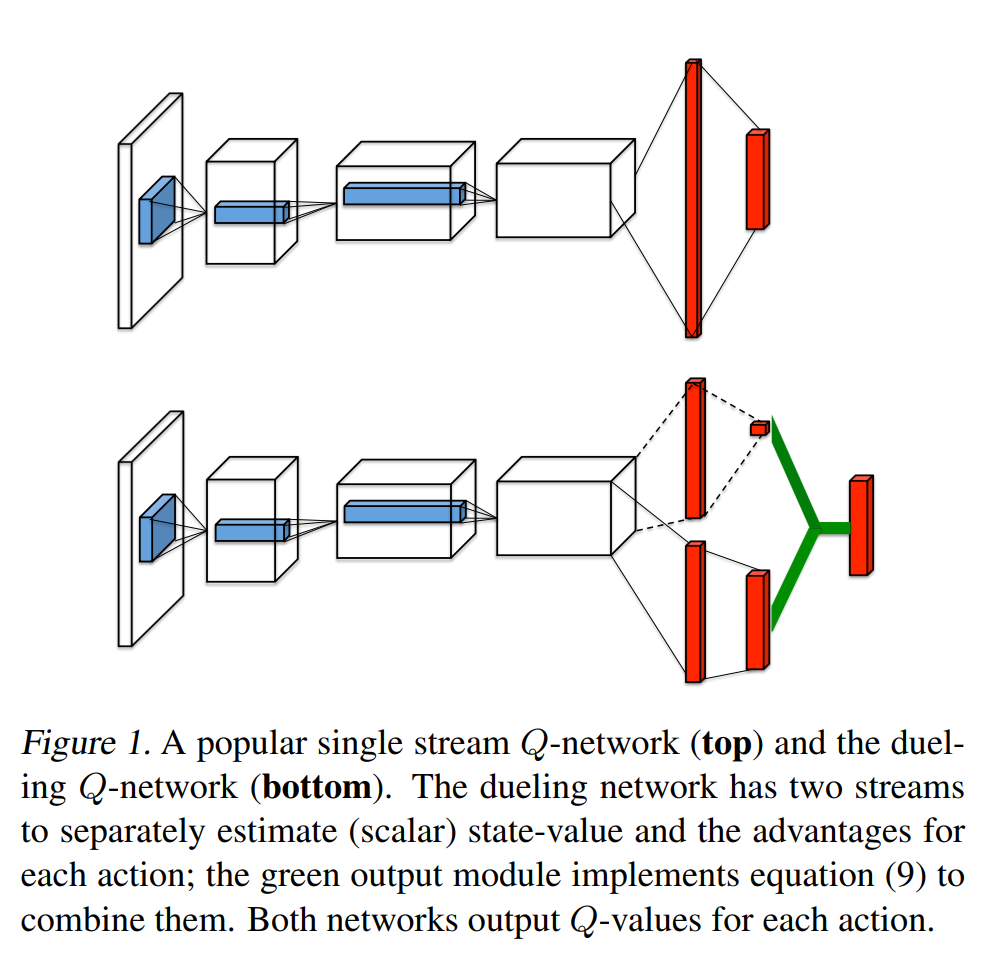
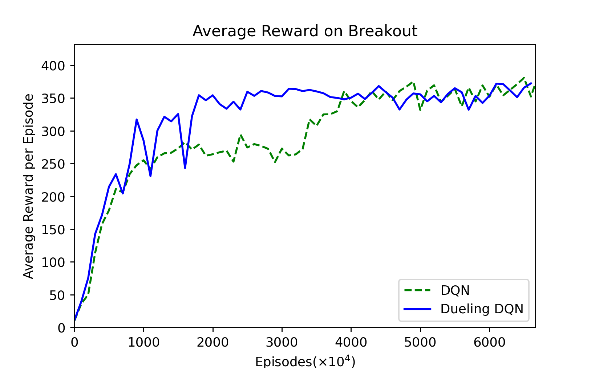
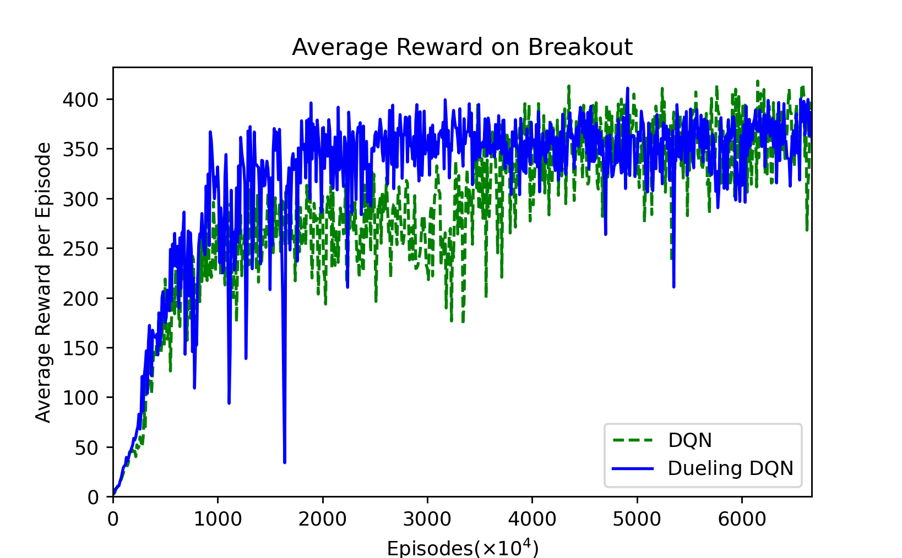
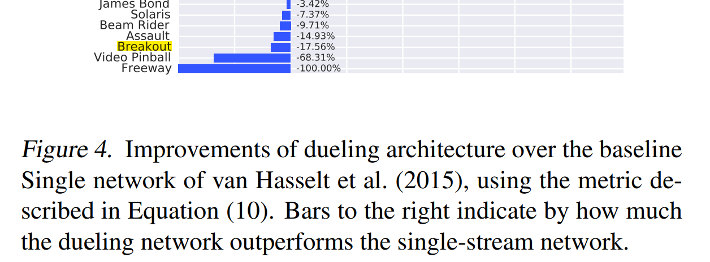
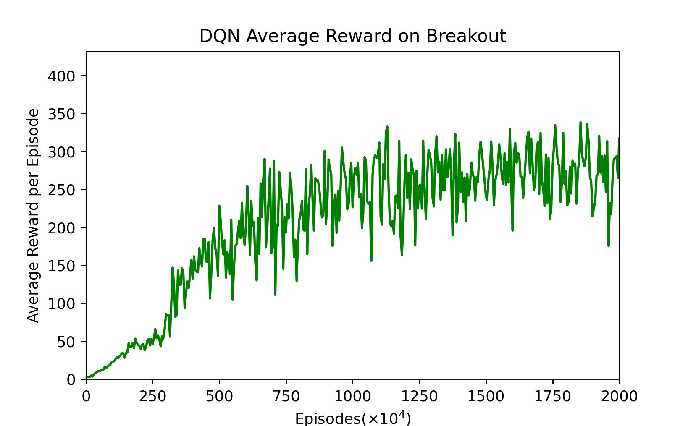
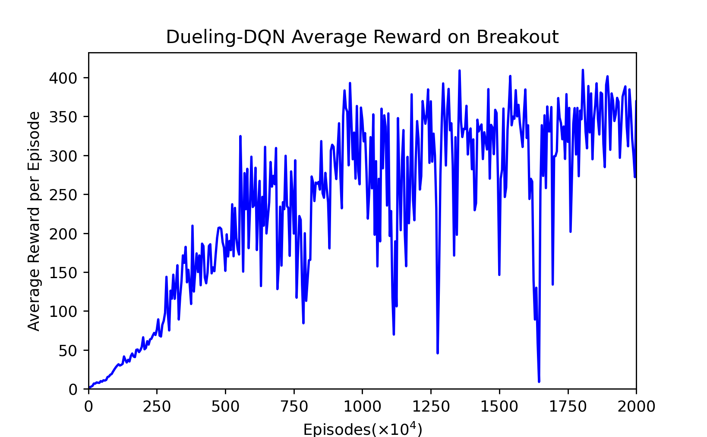

# breakout

> Mid-term assignment of DCS245 Reinforcement Learning and Game Theory Fall 2021 by 19335025 Chen Yuhan and 19335026 Chen Yuyan.

[中文](https://github.com/lzzmm/breakout/blob/main/report/zh.md)

## 0 Background

**Breakout** is an arcade game developed and published by Atari, Inc., and released on May 13, 1976. Breakout begins with eight rows of bricks, with each two rows a different kinds of color. The color order from the bottom up is yellow, green, orange and red. Using a single ball, the player must knock down as many bricks as possible by using the walls and/or the paddle below to hit the ball against the bricks and eliminate them. If the player's paddle misses the ball's rebound, they will lose a turn. The player has three turns to try to clear two screens of bricks. Yellow bricks earn one point each, green bricks earn three points, orange bricks earn five points and the top-level red bricks score seven points each. 

## 1 Introduction

### 1.1 Reinforcement Learning

Reinforcement learning considers the interactive tasks between **Agent** and **Environment**. These tasks include a series of **Action**, **Observation** and **Reward**. At each step, the agent selects an action from the action set to execute according to the current observation, with the goal of obtaining as much Reward as possible through a series of actions.

### 1.2 Markov Decision Process

The next state in the Markov decision process depends only on the current state and current action. A basic MDP can be represented by $(S, A, P)$, $S$ represents state, $A$ represents action, and $P$ represents the probability of state transition, which is the probability of transition to $s_{t+1}$ according to the current state $s_t$ and action $a_t$ . The quality of the state is equivalent to the expectation of future returns. **Return** is introduced to indicate the return that the state at a certain time $t$ will obtain, that is, $G_t$. $R$ represents Reward and $\gamma$ is the discount factor.
$$
G_t = R_{t+1} + \gamma R_{t+2} + \dots = \sum^{\infin}_{k=0}\gamma ^k R_{t+k+1}
$$
The value function is used to express the long-term potential value of a state, which is the expectation of return.
$$
v(s) = \mathbb{E}\left[ G_t | S_t = s \right]
$$
The value function can be decomposed into two parts, one is the immediate Reward $R_{t+1}$, and the other is the value of the next state multiplied by the discount factor
$$
\begin{align*}
v(s) &= \mathbb{E} \left[ G_t | S_t = s \right]\\
&= \mathbb{E} \left[ R_{t+1} + \gamma R_{t+2} + \gamma ^2 R_{t+3} + \dots | S_t = s\right]\\
&= \mathbb{E} \left[ R_{t+1} + \gamma \left(R_{t+2} + \gamma R_{t+3} + \dots\right) | S_t = s\right]\\
&= \mathbb{E} \left[ R_{t+1} + \gamma G_{t+1} | S_t = s\right]\\
&= \mathbb{E} \left[ R_{t+1} + \gamma v(S_{t+1}) | S_t = s\right]\\
\end{align*} \\
$$
The above formula is the basic form of the Bellman equation. It describes the iterative relationship between states, indicating that the value of the current state is related to the value of the next step and the current **Reward**.
$$
v(s) =  R(s) + \gamma \sum_{s'\in S}P(s'|s)v(s')
$$

### 1.3 Q-Learning

Considering that there are multiple actions to choose from in each state, and the states under each action are different, we are more concerned about the value of different actions in a certain state. We use Action-Value function to represent the return obtained after executing the $\pi$ strategy in the $s$ state.
$$
q_{\pi}(s,a)=\mathbb{E}_{\pi}\left[ G_t | S_t=s,A_t=a \right]
$$
It can also be decomposed into
$$
q_{\pi}(s,a)=\mathbb{E}_{\pi}\left[ R_{t+1} + \gamma q_{\pi}(S_{t+1},A_{t+1})| S_t=s,A_t=a \right]
$$
Now, finding the optimal strategy can be equivalent to solving the optimal Action-Value function (of course, this is just one of the methods).
$$
\begin{align}
q_{*}(s,a)&=\max_{\pi}q_{\pi}(s,a)\\
&=R_s^a + \gamma \sum_{s'\in S}P_{ss'}^a \max_{a'}q_*(s',a')
\end{align}
$$
We can use Q-learning to solve the problem. Similar to Value Iteration, Q-learning updates the Q value as follows:
$$
Q(S_t,A_t) \leftarrow Q(S_t,A_t)+\alpha\left[ R_{t+1}+\gamma \max_aQ(S_{t+1},a)-Q(S_t,A_t) \right]
$$
The specific algorithm is as follows:



### 1.4 DQN (NIPS 2013)

Generally speaking, we will use a table to store the $Q$ value, just like the Cliff Walking homework we did before. However, this method is not feasible in the Breakout to be implemented in this job, because it is too large to store the state in a table. Such a large amount of data is also difficult to learn quickly. Therefore, we use Action-Value Function Approximation to compress the dimensions of the state.

In the Breakout game, the state is high-dimensional, and the actions only move left and right and not move. So we only need to reduce the dimensionality of the state. Input a state and output a vector of states combined with different actions.

Since the input state is four consecutive $84\times 84$ images, we use a deep neural network to represent this dimensionality reduction function. Specifically, it consists of two convolutional layers and two fully connected layers, and finally outputs a vector containing the $Q$ value of each action.



Next, use the Q-Learning algorithm to train the Q network. In Q-learning, we use the target $Q$ value calculated by Reward and $Q$ to update the $Q$ value. Therefore, the loss function of Q network training is:
$$
L(w) = \mathbb{E}\left[(\underbrace{R+\gamma\max_{a'}Q(s',a',w)}_{Target}-Q(s,a,w))^2\right]
$$
The DQN algorithm proposed by NIPS 2013 is as follows:



Since the samples collected by playing Breakout are a time sequence, there is continuity between the samples. If the Q value is updated every time a sample is obtained, the effect will not be good due to the influence of the sample distribution. Therefore, a very straightforward idea is to save the samples first, and then randomly sample them, which is Experience Replay. Gradient descent is performed with randomly adopted data.

This is the case with the above DQN (NIPS 2013). First, initialize a `replay memory` $\mathcal{D}$ with a maximum capacity of $N$. Then initialize the action value function $Q$ with arbitrary weights. Then, we start the loop to let the robot play the game until the end of the game. When the game starts, we initialize a sequence and execute each step in a loop. In each step of the loop, first use the $\epsilon-greedy$ algorithm to select the action $a_t$, and then we execute the action $a_t$, get reward $r_t$ and observation $x_{t+1}$, and save it to $\mathcal{ D}$. Finally, randomly extract `replay memory` from $\mathcal{D}$ to calculate $y_j$, and use the mean square error loss function to calculate the loss, and update all the parameters of the Q network through the gradient back propagation of the neural network.

### 1.5 Nature-DQN

In early 2015, DeepMind proposed an update in the Nature journal. This time the model was changed to use two Q networks, one strategy network is used to update the network and select actions, and the other target network is used to calculate the target Q value. The target network is updated with a delay. The algorithm is as follows.



## 2 `dqn-breakout`[$^1$](https://gitee.com/goluke/dqn-breakout) Analysis

\[1\]: Base implementation: https://gitee.com/goluke/dqn-breakout

### 2.1 `main.py`

`mian.py` is the entry point of the entire program. It first defines these constants:

```c
START_STEP = 0         # start steps when using pretrained model

GAMMA = 0.99           # discount factor
GLOBAL_SEED = 0        # global seed initialize
MEM_SIZE = 100_000     # memory size
RENDER = False         # if true, render gameplay frames 

STACK_SIZE = 4         # stack size

EPS_START = 1          # starting epsilon for epsilon-greedy alogrithm
EPS_END = 0.05         # after decay steps, spsilon will reach this and keep
EPS_DECAY = 1_000_000  # steps for epsilon to decay

BATCH_SIZE = 32        # batch size of TD-learning traning value network
POLICY_UPDATE = 4      # policy network update frequency
TARGET_UPDATE = 10_000 # target network update frequency
WARM_STEPS = 50_000    # warming steps before training
MAX_STEPS = 50_000_000 # max training steps
EVALUATE_FREQ = 10_000 # evaluate frequency
```

- `START_STEP` is the number of steps for the model to start training, it is convenient to use the existing model to continue the calculation. When there is no pre-trained model, it is `0`;

- `GAMMA` is the discount (attenuation) factor $\gamma$, set to `0.99`;
- `MEM_SIZE` is the `capacity` in `ReplayMemory`;
- When `RENDER` is `TRUE`, the game process will be rendered during each evaluation;
- `STACK_SIZE` is `channels` in `ReplayMemory`;
- `EPS_START` and `EPS_END` are the start and end values of the attenuation of $\epsilon $ in the step of `EPS_DECAY`. After that, $\epsilon$ remains at `EPS_END`. It is worth mentioning that at the beginning, `EPS_START` will be ` 1`, but it is necessary to change to a smaller value when loading the model later to continue training, otherwise the performance of the loaded model will not perform well;
- `BATCH_SIZE` is the number of samples when sampling from `ReplayMemory`;
- `POLICY_UPDATE` is the update frequency of that the policy network;
- `TARGET_UPDATE` is the update frequency of the target network;
- `WARM_STEPS` is to wait until there are enough records in `ReplayMemory` to lower $\epsilon$;
- `MAX_STEPS` is the number of training steps;
- `EVALUATE_FREQ` is the frequency of evaluation.

Then initialize the random number, computing device, environment `MyEnv`, agent `Agent` and `ReplayMemory`.

Note that the purpose of setting `done` to `True` here is to initialize the environment and record the initial observations at the beginning of training.

Then start to implement the above-mentioned **Nature DQN** algorithm. In the loop, first determine whether a round has ended. If it is over, reset the environment state and put the observation data into the queue for storage:

```python
if done:
    observations, _, _ = env.reset()
    for obs in observations:
        obs_queue.append(obs)
```

Then judge whether it has gone through the `Warming steps`, if so, set `training` to `True`, and it will start to decay $\epsilon$:

```python
training = len(memory) > WARM_STEPS
```

Then observe the current state `state`, and select the action `action` according to the state, and then obtain the observed new information `obs`, feedback `reward` and the state whether the game is over `done`:

```python
state = env.make_state(obs_queue).to(device).float()
action = agent.run(state, training)
obs, reward, done = env.step(action)
```

Put the observation into the queue, and record the current state, action, feedback, and the state whether the game is over to `MemoryReplay`:

```python
obs_queue.append(obs)
memory.push(env.make_folded_state(obs_queue), action, reward, done)
```

Update the strategy network and the synchronization target network. The synchronization target network is to change the parameters of the target network to the parameters of the strategy network:

```python
if step % POLICY_UPDATE == 0 and training:
    agent.learn(memory, BATCH_SIZE)
if step % TARGET_UPDATE == 0:
    agent.sync()
```

Evaluate the current network, save the average feedback and the trained strategy network, and end the game. If `RENDER` is `True`, the frames are rendered:

```python
if step % EVALUATE_FREQ == 0:
    avg_reward, frames = env.evaluate(obs_queue, agent, render=RENDER)
    with open("rewards.txt","a") as fp:
        fp.write(f"{step//EVALUATE_FREQ:4d} {step:8d} {avg_reward:.1f}\n")
    if RENDER:
        prefix = f"eval/eval_{step//EVALUATE_FREQ:04d}"
        os.mkdir(prefix)
        for ind, frame in enumerate(frames):
            with open(os.path.join(prefix, f"{ind:06d}.png"), "wb") as fp:
                frame.save(fp, format="png")
    agent.save(f"models/model_{step//EVALUATE_FREQ:04d}")
    done = True
```

### 2.2 `utils_drl.py`

The `Agent` class is implemented in `utils_drl.py`, the model parameters are initialized when the trained model is not passed in, and loaded when the trained model is passed in parameters.

```python
if restore is None:
    self.__policy.apply(DQN.init_weights)
    else:
        self.__policy.load_state_dict(torch.load(restore))
    self.__target.load_state_dict(self.__policy.state_dict())
    self.__optimizer = optim.Adam(
        self.__policy.parameters(),
        lr=0.0000625,
        eps=1.5e-4,
    )
    self.__target.eval()
```

Four functions are defined in the `Agent` class, as follows:

1. The `run()` function implements the $\epsilon-greedy$ strategy to select an action according to the current state;

2. The `learn()` function implements updating the parameters of the neural network:

    ```python
    def learn(self, memory: ReplayMemory, batch_size: int) -> float:
        """learn trains the value network via TD-learning."""
        # get random sample from memory
        state_batch, action_batch, reward_batch, next_batch,
        done_batch = \
        memory.sample(batch_size)
        # excepted values of current state
        values = self.__policy(state_batch.float()).gather(1,
        action_batch)
        # excepted values of next state
        values_next =
        self.__target(next_batch.float()).max(1).values.detach()
        # actual values of current state = gamma * values_next + reward
        expected = (self.__gamma * values_next.unsqueeze(1)) * \
        (1. - done_batch) + reward_batch
        # loss
        loss = F.smooth_l1_loss(values, expected)
        self.__optimizer.zero_grad()
        # d
        loss.backward()
        for param in self.__policy.parameters():
        param.grad.data.clamp_(-1, 1)
        # update policy network
        self.__optimizer.step()
    return loss.item()
    ```

3. The `sync()` function updates the target network to the strategy network;

4. The `save()` function saves the current strategy network parameters.

### 2.3 `utils_env.py`

`utils_env.py` mainly implements calling the package and configuring the game environment. The main functions are as follows:

1. `reset()` initialize the game and provide 5 steps for the agent to observe the environment;
2. `step()` performs one step action and returns the latest observation, reward and boolean value of whether the game is over;
3. `evaluate()` uses the given agent model to run the game and return the average feedback value and record the frame of the game.

### 2.4 `utils_model.py`

The Nature-DQN model is implemented using `pytorch` in `utils_model.py`.

### 2.5 `utils_memory.py`

The main part of `utils_memory.py` is the implementation of `class ReplayMemory`. Mainly realize data storage and random sampling.

## 3 Dueling DQN

Dueling DQN considers dividing the Q network into two parts. The first part is only related to the state $S$, and has nothing to do with the specific action $A$. This part is called the value function, denoted as $V(S,w,α )$, the second part is related to both the state $S$ and the action $A$. This part is called the Advantage Function, denoted as $A(S,A,w,β)$, then finally the value function can be replace with
$$
V(S;w,a)+(A(S,A;w,\beta)-\frac{1}{\mathcal{A}}\sum_{a'\in |\mathcal{A}|}A(a,a';w,\beta))
$$
$w$ is the public parameter, $\alpha$ is the private parameter of $V$, and $\beta$ is the private parameter of $A$.



```python
class Dueling-DQN(nn.Module):
    def __init__(self, action_dim, device):
        super(DQN, self).__init__()
        self.__conv1 = nn.Conv2d(4, 32, kernel_size=8, stride=4, bias=False)
        self.__conv2 = nn.Conv2d(32, 64, kernel_size=4, stride=2, bias=False)
        self.__conv3 = nn.Conv2d(64, 64, kernel_size=3, stride=1, bias=False)
        self.__fc1_a = nn.Linear(64*7*7, 512)
        self.__fc1_v = nn.Linear(64*7*7, 512)
        self.__fc2_a = nn.Linear(512, action_dim)
        self.__fc2_v = nn.Linear(512, 1)
        self.__act_dim = action_dim
        self.__device = device

    def forward(self, x):
        x = x / 255.
        x = F.relu(self.__conv1(x))
        x = F.relu(self.__conv2(x))
        x = F.relu(self.__conv3(x))
        xv = x.view(x.size(0), -1)
        vs = F.relu(self.__fc1_v(xv))
        vs = self.__fc2_v(vs).expand(x.size(0), self.__act_dim)
        asa = F.relu(self.__fc1_a(xv))
        asa = self.__fc2_a(asa)
 
        return vs + asa - asa.mean(1).unsqueeze(1).expand(x.size(0),self.__act_dim)
    
```


## 4 Experiments

### 4.1 Rewards Analysis

Our experiment reduced $\epsilon$ from `1` to `0.1` in the first one million times, and it took another one million times to reduce it to `0.01`. The following is our analysis of the experimental results.



*Figure 1: Sampled every $10^6$ episodes,  $6666 \times 10^4$  episodes.*

First of all, from this smoothed average reward graph, we can see that in the first 16 million trainings, Dueling-DQN is better than DQN most of the time, indicating that the training is faster. Until 40 million, DQN remained below the Dueling-DQN. It took 35 to 40 million trainings before DQN began to grow again. The average reward value of DQN after 40 million trainings is slightly higher than that of Dueling-DQN. This is also similar to the result in the Dueling-DQN paper. When they tested Breakout, the final result was indeed not as good as DQN, but the fitting speed was slightly faster. We speculate that this is because there are few actions in Breakout, so the improvement is not obvious.




*Figure 1: Sampled every $10^5$ episodes, $6666 \times 10^4$ episodes.*

This picture is not smoothed. We can find that the Dueling-DQN fluctuates greatly before fitting, but the fluctuation after fitting is smaller than DQN.

According to our statistics, the average reward of Dueling-DQN in the following three stages has improved relative to the average reward of DQN as follows:

| Episodes                          | 0 - 2000 | 2000 - 4000 | 4000 - 6000 |
| --------------------------------- | -------- | ----------- | ----------- |
| Avg. Reward: Dueling-DQN/DQN-100% | 14.6563% | 22.9607%    | -0.7542%    |



The following two pictures are their magnifications before fitting.



*Figure 3: DQN's average reward per every $5 \times 10^4$ episodes, $2000 \times 10^4$ episodes.*




*Figure 4: Dueling-DQN's average reward per every $5 \times 10^4$ episodes, $2000 \times 10^4$ episodes.*

### 4.2 Video

The video of these two agents playing breakout is [here](https://www.bilibili.com/video/BV1XL411u7XM/).

## 5 Summary

### 5.1 Summary

The main task of this experiment is to study the implementation of the basic Nature-DQN, and then make certain optimizations on this basis. The optimization direction we choose is Dueling DQN. The improvement of Dueling DQN lies in the neural network. The original neural network consists of 3 convolutional layers and 2 fully connected layers. Dueling DQN splits the last two fully connected layers into two parts. Each part is made of two fully connected layers. Connection layer. Experimental results show that the convergence speed of Dueling DQN is faster than Nature-DQN, but the final reward is slightly worse than Nature-DQN.

### 5.2 Open Source Repository

Our code and report are open source at [lzzmm/breakout](https://github.com/lzzmm/breakout).

## References

[Playing Atari with Deep Reinforcement Learning](https://arxiv.org/abs/1312.5602v1)

[Human-level control through deep reinforcement learning](https://web.stanford.edu/class/psych209/Readings/MnihEtAlHassibis15NatureControlDeepRL.pdf)

[Dueling Network Architectures for Deep Reinforcement Learning](https://arxiv.org/abs/1511.06581v3)
