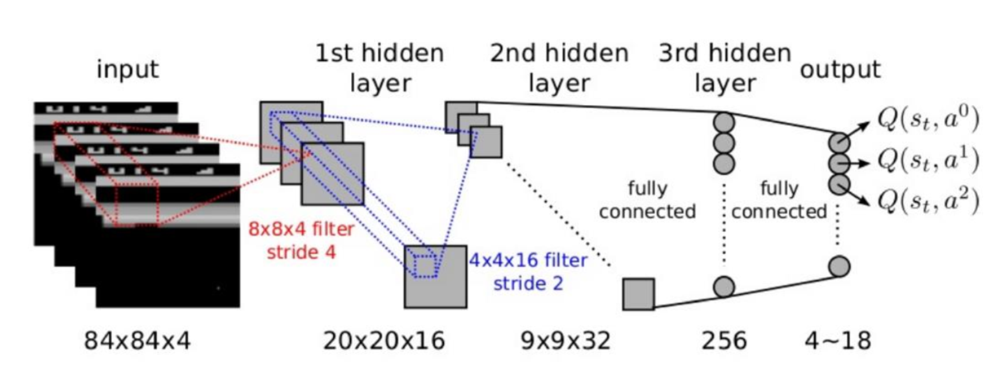
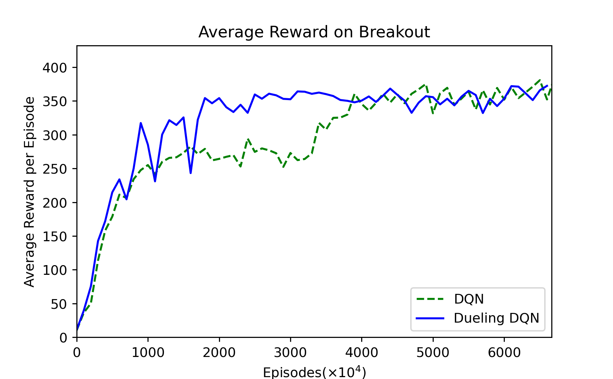
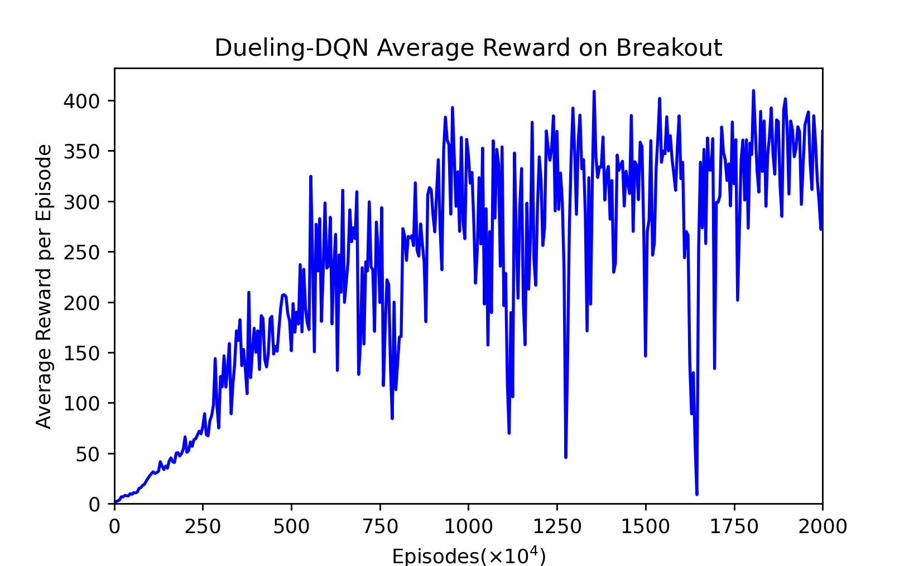

## 

DCS245 <br>Reinforcement Learning and Game Theory<br>2021 Fall

# Mid-term Assignment

##### `19335025` 陈禹翰<br>`19335026` 陈煜彦


## 0 背景

《**Breakout**》是一款由雅达利开发及发布的街机游戏。游戏开始时，画面显示8排砖块，每隔两排，砖块的颜色就不同。由下至上的颜色排序为黄色、绿色、橙色和红色。游戏开始后，玩家必须控制一块平台左右移动以反弹一个球。当那个球碰到砖块时，砖块就会消失，而球就会反弹。当玩家未能用平台反弹球的话，那么玩家就输掉了那个回合。当玩家连续输掉3次后(这里使用了5次)，玩家就会输掉整个游戏。玩家在游戏中的目的就是清除所有砖块。


## 1 从马尔科夫链到 DQN

### 1.1 强化学习

强化学习考虑**智能体Agent**和**环境Environment**之间交互的任务，这些任务包含一系列的**动作Action**, **观察Observation**还有**反馈值Reward**。智能体每一步根据当前的观察从动作集合中选择一个动作执行，目的是通过一系列动作获得尽可能多的反馈值。

### 1.2 MDP

马尔可夫决策过程中下一个状态仅取决于当前的状态和当前的动作。一个基本的 MDP 可以用 $(S,A,P)$ 来表示，$S$表示状态，$A$表示动作，$P$表示状态转移概率，也就是根据当前的状态$s_t$和$a_t$转移到$s_{t+1}$的概率。状态的好坏等价于对未来回报的期望，引入**回报Return**来表示某个时刻$t$的状态将具备的回报，也就是 $G_t$。$R$ 表示反馈，$\gamma$ 是折扣因子。
$$
G_t = R_{t+1} + \gamma R_{t+2} + \dots = \sum^{\infin}_{k=0}\gamma ^k R_{t+k+1}
$$
价值函数用来表示一个状态的长期潜在价值，也就是回报的期望
$$
v(s) = \mathbb{E}\left[ G_t | S_t = s \right]
$$
价值函数可以被分解为两部分，一个是立即反馈 $R_{t+1}$，还有一个是下一个状态的价值乘上折扣
$$
\begin{align*}
v(s) &= \mathbb{E} \left[ G_t | S_t = s \right]\\
&= \mathbb{E} \left[ R_{t+1} + \gamma R_{t+2} + \gamma ^2 R_{t+3} + \dots | S_t = s\right]\\
&= \mathbb{E} \left[ R_{t+1} + \gamma \left(R_{t+2} + \gamma R_{t+3} + \dots\right) | S_t = s\right]\\
&= \mathbb{E} \left[ R_{t+1} + \gamma G_{t+1} | S_t = s\right]\\
&= \mathbb{E} \left[ R_{t+1} + \gamma v(S_{t+1}) | S_t = s\right]\\
\end{align*} \\
$$
上面这个公式就是**Bellman方程**的基本形态，它描述了状态之间的迭代关系，说明当前状态的价值和下一步的价值以及当前的**反馈Reward**有关。
$$
v(s) =  R(s) + \gamma \sum_{s'\in S}P(s'|s)v(s')
$$

###  1.3 Q-Learning

考虑到每个状态之后都有多种动作可以选择，每个动作之下的状态又多不一样，我们更关心在某个状态下的不同动作的价值。我们使用 Action-Value function 来表示在 $s$ 状态下执行 $\pi$ 策略之后获得的回报。
$$
q_{\pi}(s,a)=\mathbb{E}_{\pi}\left[ G_t | S_t=s,A_t=a \right]
$$
它也可以被分解为
$$
q_{\pi}(s,a)=\mathbb{E}_{\pi}\left[ R_{t+1} + \gamma q_{\pi}(S_{t+1},A_{t+1})| S_t=s,A_t=a \right]
$$
现在，要寻找最优策略则可以等价于求解最优的 Action-Value function （当然，这只是其中的一种方法）。
$$
\begin{align}
q_{*}(s,a)&=\max_{\pi}q_{\pi}(s,a)\\
&=R_s^a + \gamma \sum_{s'\in S}P_{ss'}^a \max_{a'}q_*(s',a')
\end{align}
$$
我们可以使用 Q-learning 的方式来求解。类似于 Value Iteration，Q-learning 更新 Q 值的方法如下：
$$
Q(S_t,A_t) \leftarrow Q(S_t,A_t)+\alpha\left[ R_{t+1}+\gamma \max_aQ(S_{t+1},a)-Q(S_t,A_t) \right]
$$
具体算法如下：


### 1.4 DQN (NIPS 2013)

一般来说，我们会使用一个表格来存储 Q 值，就像之前做过的 Cliff Walking 作业一样。但是在此次作业要实现的 Breakout 中这个方法不太可行，因为数据实在是太大了，不可能通过表格来存储状态。如此大的数据也难以快速学习。因此我们使用 Action-Value Function Approximation 对状态的维度进行压缩。

在 Breakout 游戏中，状态是高维度的，而动作只有左移右移和不动。所以我们只需要对状态进行降维。输入一个状态输出一个状态与不同动作结合的向量。

由于输入的状态是四个连续的 $84\times 84$ 图像，所以我们使用深度神经网络来表示这个降维的函数。具体由两个卷积层和两个全连接层组成，最后输出包含每一个动作 Q 值的向量。



接下来利用 Q-Learning 算法训练 Q 网络。在 Q-learning 中，我们利用 Reward 和 Q 计算出来的目标 Q 值来更新 Q 值，因此，Q 网络训练的损失函数就是：
$$
L(w) = \mathbb{E}\left[(\underbrace{R+\gamma\max_{a'}Q(s',a',w)}_{Target}-Q(s,a,w))^2\right]
$$
NIPS 2013 提出的 DQN 算法如下：


由于玩 Breakout 采集的样本是一个时间序列，样本之间具有连续性，如果每次得到样本就更新 Q 值，受样本分布影响，效果会不好。因此，一个很直接的想法就是把样本先存起来，然后随机采样，也就是 Experience Replay。通过随机采用的数据进行梯度下降。

以上的 DQN (NIPS 2013) 便是如此。首先，初始化一个最大容量为 $N$ 的 `replay memory` $\mathcal{D}$。然后初始化使用任意权重来初始化动作价值函数 $Q$ 。然后，我们开始循环让机器人玩游戏直到游戏结束。游戏开始的时候我们初始化一个序列然后循环执行每一步。每步循环中，首先使用 $\epsilon - greedy$ 算法选择动作 $a_t$，然后我们执行动作 $a_t$，得到反馈 $r_t$ 和观察 $x_{t+1}$，保存到 $\mathcal{D}$ 中。最后在 $\mathcal{D}$ 中随机抽取 `replay memory` 来计算 $y_j$，并使用均方差损失函数计算损失，通过神经网络的梯度反向传播来更新 Q 网络的所有参数。 

### 1.5 Nature-DQN

2015年初，DeepMind 又在 Nature 期刊上提出了更新，此次将模型更改为使用两个 Q 网络，一个策略网络用来更新网络和选择动作，另一个目标网络用来计算目标 Q 值。目标网络延时更新。算法如下。


## 2 dqn-breakout[$^1$](https://gitee.com/goluke/dqn-breakout)  的结构解析

\[1\]: Base implementation: https://gitee.com/goluke/dqn-breakout

### 2.1 `main.py`

`mian.py` 是整个程序的入口，它首先定义了这些常量：

```c
START_STEP = 0         # start steps when using pretrained model

GAMMA = 0.99           # discount factor
GLOBAL_SEED = 0        # global seed initialize
MEM_SIZE = 100_000     # memory size
RENDER = False         # if true, render gameplay frames 

STACK_SIZE = 4         # stack size

EPS_START = 1          # starting epsilon for epsilon-greedy alogrithm
EPS_END = 0.05         # after decay steps, spsilon will reach this and keep
EPS_DECAY = 1_000_000  # steps for epsilon to decay

BATCH_SIZE = 32        # batch size of TD-learning traning value network
POLICY_UPDATE = 4      # policy network update frequency
TARGET_UPDATE = 10_000 # target network update frequency
WARM_STEPS = 50_000    # warming steps before training
MAX_STEPS = 50_000_000 # max training steps
EVALUATE_FREQ = 10_000 # evaluate frequency
```

- `START_STEP` 是模型开始训练的步数，方便使用已有的模型继续计算。没有使用预先训练好的模型开始计算时为 `0`；

- `GAMMA` 是折扣（衰减）因子 $\gamma$ ，设为 `0.99`；
- `MEM_SIZE` 是 `ReplayMemory` 中的 `capacity`；
- `RENDER` 为 `TRUE` 的时候在每次评价的时候都会渲染游戏画面；
- `STACK_SIZE` 是 `ReplayMemory` 中的 `channels`；
- `EPS_START` 和 `EPS_END` 是在 `EPS_DECAY` 步中 $\epsilon $ 衰减的开始和结尾值，之后 $\epsilon$ 一直保持在 `EPS_END` ，值得一提的是一开始 `EPS_START` 会是 `1` ，但是后面加载模型继续训练的时候有必要更改成较小的数值，否则加载的模型的性能不能很好地表现；
- `BATCH_SIZE` 是在从 `ReplayMemory` 中取样的时候的取样个数；
- `POLICY_UPDATE` 是策略网络更新的频率；
- `TARGET_UPDATE` 是目标网络更新的频率；
- `WARM_STEPS` 是为了等到 `ReplayMemory` 中有足够的记录的时候再开始降低 $\epsilon$ ；
- `MAX_STEPS` 是训练的步数；
- `EVALUATE_FREQ` 是评价的频率。

接着初始化随机数，初始化计算设备，初始化环境 `MyEnv`、智能体 `Agent` 和 `ReplayMemory`。

注意此处把 `done` 置为 `True` 是为了开始训练时初始化环境并记录一开始的观察。

然后开始实现上面所说的 **Nature DQN** 算法，在循环中首先判断一个回合是否已经结束，若结束则重置环境状态并将观察数据入队存储：

```python
if done:
    observations, _, _ = env.reset()
    for obs in observations:
        obs_queue.append(obs)
```

接着判断是否已经经过 `Warming steps` ，若是，则将 `training` 置为 `True` ，此时则会开始衰减 $\epsilon$：

```python
training = len(memory) > WARM_STEPS
```

接着观察现在的状态 `state`，并根据状态选择动作 `action`，然后获得观察到的新的信息 `obs`、反馈 `reward` 和是否结束游戏的状态 `done`：

```python
state = env.make_state(obs_queue).to(device).float()
action = agent.run(state, training)
obs, reward, done = env.step(action)
```

把观察入队，把当前状态、动作、反馈、是否结束都记录入 `MemoryReplay`：

```python
obs_queue.append(obs)
memory.push(env.make_folded_state(obs_queue), action, reward, done)
```

更新策略网络和同步目标网络，同步目标网络就是把目标网络的参数更新为策略网络的参数：

```python
if step % POLICY_UPDATE == 0 and training:
    agent.learn(memory, BATCH_SIZE)
if step % TARGET_UPDATE == 0:
    agent.sync()
```

评价当前网络，将平均反馈和训练出来的策略网络保存，并结束游戏。若 `RENDER` 为 `True` 则渲染游戏画面：

```python
if step % EVALUATE_FREQ == 0:
    avg_reward, frames = env.evaluate(obs_queue, agent, render=RENDER)
    with open("rewards.txt","a") as fp:
        fp.write(f"{step//EVALUATE_FREQ:4d} {step:8d} {avg_reward:.1f}\n")
    if RENDER:
        prefix = f"eval/eval_{step//EVALUATE_FREQ:04d}"
        os.mkdir(prefix)
        for ind, frame in enumerate(frames):
            with open(os.path.join(prefix, f"{ind:06d}.png"), "wb") as fp:
                frame.save(fp, format="png")
    agent.save(f"models/model_{step//EVALUATE_FREQ:04d}")
    done = True
```


### 2.2 `utils_drl.py`

`utils_drl.py` 中实现了智能体 `Agent` 类，初始化了传入参数和两个模型，并且在没有传入训练好的模型的时候初始化模型参数，在传入训练好的模型的时候加载模型参数。

```python
if restore is None:
    self.__policy.apply(DQN.init_weights)
    else:
        self.__policy.load_state_dict(torch.load(restore))
    self.__target.load_state_dict(self.__policy.state_dict())
    self.__optimizer = optim.Adam(
        self.__policy.parameters(),
        lr=0.0000625,
        eps=1.5e-4,
    )
    self.__target.eval()
```

`Agent` 类中定义了四个函数，分别如下：

1. `run()` 函数实现了通过 $\epsilon - greedy$ 策略根据现在的状态选择一个动作；

2. `learn()` 函数实现了更新神经网络的参数：

   ```python
   def learn(self, memory: ReplayMemory, batch_size: int) -> float:
       """learn trains the value network via TD-learning."""
       # 从memory中随机取样本
       state_batch, action_batch, reward_batch, next_batch,
       done_batch = \
       memory.sample(batch_size)
       # state预期的values
       values = self.__policy(state_batch.float()).gather(1,
       action_batch)
       # 下一个state预期的values
       values_next =
       self.__target(next_batch.float()).max(1).values.detach()
       # state现实的values=衰减因子gamma*values_next+reward
       expected = (self.__gamma * values_next.unsqueeze(1)) * \
       (1. - done_batch) + reward_batch
       # 损失
       loss = F.smooth_l1_loss(values, expected)
       self.__optimizer.zero_grad()
       # 求导
       loss.backward()
       for param in self.__policy.parameters():
       param.grad.data.clamp_(-1, 1)
       #更新policy神经网络的参数
       self.__optimizer.step()
   	return loss.item()
   ```

3. `sync()` 函数将目标网络延时更新为策略网络；

4. `save()` 函数保存当前的策略网络参数。


### 2.3 `utils_env.py`

`utils_env.py` 主要实现了调用包并配置运行的游戏环境，主要的几个函数如下：

1. `reset()` 初始化游戏并提供5步的时间让智能体观察环境；
2. `step()` 执行一步动作，返回最新的观察，反馈和游戏是否结束的布尔值；
3. `evaluate()` 使用给定的智能体模型来运行游戏并返回平均反馈值和记录游戏的帧。

### 2.4 `utils_model.py`

`utils_model.py` 中使用 `pytorch` 实现了 Nature-DQN 模型。

### 2.5 `utils_memory.py`

`utils_memory.py` 中主要是 `class ReplayMemory` 的实现。主要实现了数据存储和随机抽样。 

## 3 使用 Dueling DQN 提高性能

Dueling DQN 考虑将 Q 网络分成两部分，第一部分是仅仅与状态 $S$ 有关，与具体要采用的动作 $A$ 无关，这部分我们叫做价值函数部分，记做$V(S,w,α)$，第二部分同时与状态状态 $S$ 和动作 $A$ 有关，这部分叫做优势函数(Advantage Function)部分,记为 $A(S,A,w,β)$ ，那么最终我们的价值函数可以将原来的 $Q(S,A;w)$ 替换为
$$
V(S;w,a)+(A(S,A;w,\beta)-\frac{1}{\mathcal{A}}\sum_{a'\in |\mathcal{A}|}A(a,a';w,\beta))
$$
$w$ 是公共部分参数，$\alpha$ 是 $V$ 独有的参数，$\beta$ 是 $A$ 独有的参数。


```python
class Dueling-DQN(nn.Module):
    def __init__(self, action_dim, device):
        super(DQN, self).__init__()
        self.__conv1 = nn.Conv2d(4, 32, kernel_size=8, stride=4, bias=False)
        self.__conv2 = nn.Conv2d(32, 64, kernel_size=4, stride=2, bias=False)
        self.__conv3 = nn.Conv2d(64, 64, kernel_size=3, stride=1, bias=False)
        self.__fc1_a = nn.Linear(64*7*7, 512)
        self.__fc1_v = nn.Linear(64*7*7, 512)
        self.__fc2_a = nn.Linear(512, action_dim)
        self.__fc2_v = nn.Linear(512, 1)
        self.__act_dim = action_dim
        self.__device = device

    def forward(self, x):
        x = x / 255.
        x = F.relu(self.__conv1(x))
        x = F.relu(self.__conv2(x))
        x = F.relu(self.__conv3(x))
        xv = x.view(x.size(0), -1)
        vs = F.relu(self.__fc1_v(xv))
        vs = self.__fc2_v(vs).expand(x.size(0), self.__act_dim)
        asa = F.relu(self.__fc1_a(xv))
        asa = self.__fc2_a(asa)
 
        return vs + asa - asa.mean(1).unsqueeze(1).expand(x.size(0),self.__act_dim)
    
```


## 4 Experiments

我们的实验在前一百万次把 $\epsilon$ 从 `1` 降低到 `0.1`，又花了一百万次降低到 `0.01`。以下是我们对实验结果的分析。



*Figure 1: Sampled every $10^6$ episodes,  $6666 \times 10^4$  episodes.*

首先从这张平滑过后的平均反馈图可以看到，在前一千六百万次左右的训练中，Dueling-DQN 大部分时间要比 DQN 高，说明训练的比较快。在四千万次训练之前，DQN 一直保持低于 Dueling-DQN 的反馈。到了三千五百万次到四千万次左右训练的时候，DQN 才又开始增长。四千万次训练之后 DQN 的平均反馈值略高于 Dueling-DQN 的平均反馈值。不过这也和 Dueling-DQN 论文中的结果相似，他们在测试 Breakour 的时候确实最后结果不如 DQN，但是拟合速度略快，我们推测这是由于 Breakout 中的动作比较少，所以提升不明显。


*Figure 1: Sampled every $10^5$ episodes, $6666 \times 10^4$ episodes.*

这张图是没有做过多平滑的，可以看出拟合之前 Dueling-DQN 波动较大，拟合后波动比 DQN 小一点。

我们统计得知，他们在下面三个阶段 Dueling-DQN 的平均反馈值相对于 DQN 的平均反馈值的提升如下：

| Episodes                          | 0 - 2000 | 2000 - 4000 | 4000 - 6000 |
| --------------------------------- | -------- | ----------- | ----------- |
| Avg. Reward: Dueling-DQN/DQN-100% | 14.6563% | 22.9607%    | -0.7542%    |


下面两张图是他们拟合前的放大。


*Figure 3: DQN's average reward per every $5 \times 10^4$ episodes, $2000 \times 10^4$ episodes.*




*Figure 4: Dueling-DQN's average reward per every $5 \times 10^4$ episodes, $2000 \times 10^4$ episodes.*


## 5 总结

### 5.1 总结


### 5.2 Open Source Repository

Our code and report are open source at [lzzmm/breakout](https://github.com/lzzmm/breakout).

### 5.3 Authorship

| Name   | ID         | Ideas(%) | Coding(%) | Writing(%) |
| ------ | ---------- | -------- | --------- | ---------- |
| 陈禹翰 | `19335025` | `0%`     | `0%`      | `0%`       |
| 陈煜彦 | `19335026` | `0%`     | `0%`      | `0%`       |

## References

[Playing Atari with Deep Reinforcement Learning](https://arxiv.org/abs/1312.5602v1)

[Human-level control through deep reinforcement learning](https://web.stanford.edu/class/psych209/Readings/MnihEtAlHassibis15NatureControlDeepRL.pdf)

[Dueling Network Architectures for Deep Reinforcement Learning](https://arxiv.org/abs/1511.06581v3)

